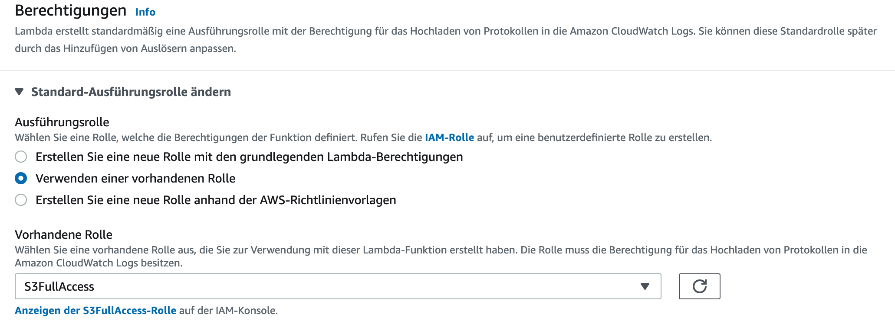
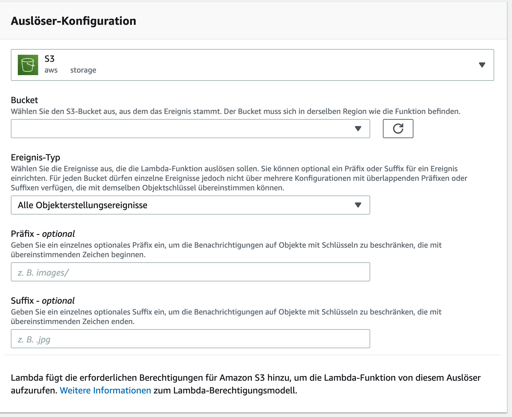

# AWS Lambda: updateContentType

Lambda Funktion um den ContentType einer Datei direkt beim hochladen auf "binary/octet-stream" zu setzten.

Hierfür muss das Objekt von einen Ablagebucket auf das Zielbucket kopiert werden. Dabei wird der ContentType direkt angepasst. Die Datei im Ablagebucket wird anschließend gelöscht.

## Voreinstellungen

1. Ablage- und Zielbucket erstellen.
2. IAM Rolle erstellen: 

Als Berechtigung muss voller S3 Zugriff gewährleistet werden. In der IAM Management Konsole muss dafür eine gesonderte Rolle angelegt werden:

1. [IAM Konsole öffnen](https://console.aws.amazon.com/iamv2/home?#/roles) → Neue Rolle erstellen, Anwendungsfall: Lambda
2. Nach S3 filtern und '[AmazonS3FullAccess](https://console.aws.amazon.com/iam/home#/policies/arn%3Aaws%3Aiam%3A%3Aaws%3Apolicy%2FAmazonS3FullAccess)' Rolle wählen.
3. Tags können leergelassen werden.
4. Rollenname vergeben (z.B. S3LambdaFullAccess) und Rolle erstellen.

## Lambda Funktion erstellen

1. Funktion erstellen ohne Vorgabe
2. Name wählen (z.B. updateContentType)
3. Bei Laufzeit Python 3.9 als Programmiersprache wählen
4. Bei Berechtigungen zuvor erstellte Rolle verwenden (Menü aufklappen und wie unten Eingaben wählen):
    
    
    
    Haken bei 'Verwenden einer vorhandenen Rolle' setzen und unten zuvor erstellte Rolle auswählen.
    
5. Anschließend Funktion erstellen klicken.

## Trigger

Als Auslöser wird jede Form der Objekterstellung in dem S3 Ablagebucket gewählt. Optional kann man einzelne Ordner spezifizieren.



Zunächst nach S3 suchen und wählen (ganz oben), dann öffnet sich unteres Menü. Dort muss das Ablagebucket ausgewählt werden und als Ereignistyp werden alle Objekterstellungsereignisse ausgewählt. Den Haken bei rekursivem Aufruf setzen und die den Trigger erstellen.

## Code

Anschließend muss der Code für die Lambda Funktion spezifiziert werden.

Orientiert am GitHub Repo von [prabhakar2020](https://github.com/prabhakar2020/aws_lambda_function/tree/master/s3_copy_data) ergibt sich folgende Funktion:

```python
import boto3
import time, urllib.parse
import json

s3 = boto3.client('s3')

def lambda_handler(event, context):
    source_bucket = event['Records'][0]['s3']['bucket']['name']
    object_key = urllib.parse.unquote_plus(event['Records'][0]['s3']['object']['key'])
    target_bucket = '<target-bucket>'
    copy_source = {'Bucket': source_bucket, 'Key': object_key}
    try:
        # Using waiter to wait for the object to persist through s3 service
        waiter = s3.get_waiter('object_exists')
        waiter.wait(Bucket=source_bucket, Key=object_key)
        # Copy object to target bucket with adapted ContentType
        s3.copy_object(Bucket=target_bucket, Key=object_key, ContentType='binary/octet-stream', CopySource=copy_source, MetadataDirective='REPLACE')
        # Delete object from source bucket
        s3.delete_object(Bucket=source_bucket, Key=object_key)
        return response['ContentType']
    except Exception as err:
        print ("Error -"+str(err))
        return err
```
Als `<target-bucket>` muss hier noch der entsprechende Name des Zielbuckets eingegeben werden.

Anschließend kann die Funktion deployed werden. Wird nun in das Ablagebucket eine Datei hochgeladen so wird sie mit dem angepassten ContentType in das Zielbucket kopiert und im Anschluss aus dem Ablagebucket gelöscht.

## Bemerkungen

1. Wird im Ablagebucket eine Datei hochgeladen, zu der eine gleichnamige Datei im Zielbucket bereits existiert, so wird die Datei im Zielbucket überschrieben. Falls dies nicht passieren soll kann die Funktion erweitert werden um solche Fälle abzufangen und den Dateinamen zu ändern o.ä.
2. Um rekursive Aufrufe der Lambda Funktion zu verhindern darf das Ablagebucket nicht dem Zielbucket entsprechen.
